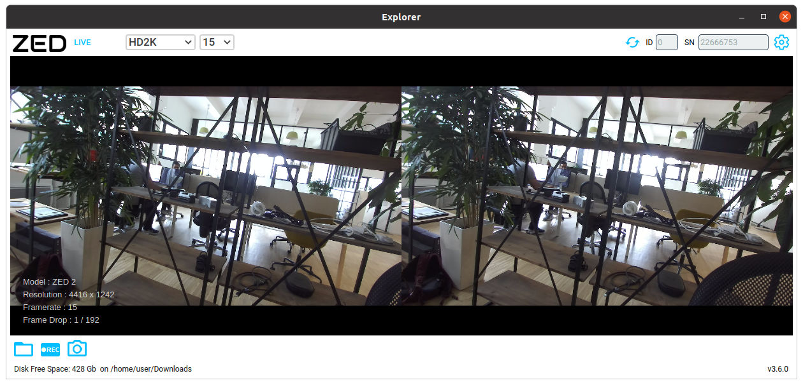

# ZED Explorer

## Overview

The ZED Explorer is an application for ZED live preview and recording. It lets you change video resolution, aspect ratio, camera parameters, and capture high resolution snapshots and 3D video.

If the ZED is recognized by your computer, you’ll see the 3D video from your camera.

You can run the application with a ZED connected or with an already existing video using the SVO Format.

## Features

This section details the different features that come with the ZED Explorer

### Available parameters

* Input : By default use the live view of your ZED, but you can load a SVO file to visualize an already recorded video
* Resolution : Set the desired image resolution, going from VGA to HD2K
* Frame rate : Choose at which framerate to sample the image, starting from 15 and up to 100 FPS. The framerate depends on the chosen resolution
* Flip mode : Flip the images to 180° if your camera is fixed upside down
* Image Enhancement : When enabled, choose automaticaly the gamma correction (see Camera settings)
* Camera settings
    * Brigthness : Choose the Camera Brightness in a scale from 0 to 8
    * Contrast : Choose the Camera Contrast in a scale from 0 to 8
    * HUE : Choose the Camera HUE in a scale from 0 to 11
    * Saturation : Choose the Camera Saturation in a scale from 0 to 8
    * Sharpness : Choose the Camera Sharpness in a scale from 0 to 8
    * Gamma : Choose the Camera Gamma in a scale from 1 to 9
    * White balance (Auto) : Choose the Camera Brightness in a scale from 2800 to 6500. When Auto mode enabled, choose automaticaly the best White balance
    * Gain (Auto) : Choose the Camera Gain in a scale from 0 to 100. When Auto mode enabled, choose automaticaly the best Gain and Exposure
    * Exposure (Auto) : Choose the Camera Exposure in a scale from 0 to 100. When Auto mode enabled, choose automaticaly the best Gain and Exposure
    * Default values : Restore default values of the Camera settings

* Saving informations
    * Output Directory : Choose the folder where you want to save your recorded sequences or images.
    * SVO compression : Choose a SVO compression mode in the following options : LOSSLESS, LOSSY, H264 (GPU), H265 (GPU)
    * Image Save Format : Choose the desired resolution format for your images. Could be PNG, JPEG or BMP.
    * Auto naming : When disabled, will ask you to give a name for each recorded sequence/image.
* Firmware
    * Camera Firmware Update : Choose a new version of the Camera Firmware in your files to update it.
    * IMU Firmware Update : Choose a new version of the IMU Firmware in your files to update it.