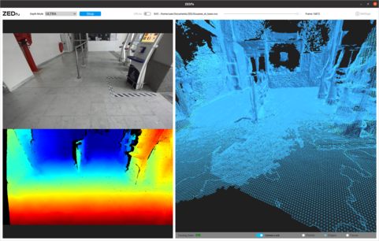

# ZEDfu

## Overview 

The ZED's Spatial Mapping module, including the standalone ZEDfu app, enables 3D scanning of a scene. The colored 3D mesh model is created by integrating the ZED image and depth data over time from multiple viewpoints.

## Quick Start

* Set your preference in the settings menu 
* Choose a depth mode 
* Select an input. Input can be a svo file (pre-saved videos from a zed camera) or live-streamed with a connected zed camera
* Click start and wait for the mesh or fused point cloud to be created

## Features

#### Depth Modes

Several depth modes are available to fit your application’s needs. These settings adjust the level of accuracy, range and computational performance of the depth sensing module.

* **Ultra**: offers the highest depth range and better preserves Z-accuracy along the sensing range.
* **Quality**: has a strong filtering stage giving smooth surfaces.
* **Performance**: designed to be smooth, can miss some details.

#### Input 

* **Live**
* **SVO**: you can enable the offline mode. There is a timeline on the top right to select where the video starts.

#### Load map 
 
Previously generated mesh or fused point clouds (.pth and .obj files) are loadable via the Load map button one at a time.

## Settings

* **Spatial Map Type**: Choose between Mesh and fused cloud points.
* **Resolution Preset**: Controls the level of detail of the spatial map. A higher resolution will provide a more detailed spatial map. Capturing maps with high density requires more memory and resources. 
* **Range Preset**: Controls the range of the depth data used to build the spatial map. Increasing the mapping range allows the SDK to capture larger volumes quickly, but at the cost of accuracy. Reducing the range will improve spatial mapping performance.
* **Mesh Filtering**: Filtering is often desirable to reduce the number of polygons per mesh after capture to improve performance when the mesh is used. Mesh Filtering lets you decimate and optimize the 3D models to reduce polygon count while preserving desirable geometric features.
* **Save raw mesh**: Choose whether you want to save raw mesh objects or not.
* **Apply texture**: ZEDfu can map the 2D images captured during spatial mapping onto the 3D model surface, resulting in a textured mesh.

## Best Practices

While the Spatial Mapping module produces outstanding large-scale 3D models using only stereo vision, there are environments that will adversely affect performance, such as indoors and low-light places.

We recommend the following best practices when using Spatial Mapping: 

* Move slowly
* For optimal results, use ZEDfu for 
outdoors scanning. Indoors scanning is possible but untextured and low-light areas may introduce artefacts and incorrect surfaces in the resulting 3D model.
* Don’t get too close to objects and surfaces you are scanning – remember the ZED minimum range is around 1m
* Make sure your scene is well-lit
* Don’t move the sensor too fast to avoid motion blur. The resulting 3D geometry will have a lower resolution if created with blurry images
* Avoid reflective objects

Remember that the Spatial Mapping module, including ZEDfu, accepts two types of inputs: live images from the ZED camera or recorded video files from the ZED camera (called Offline Processing).

